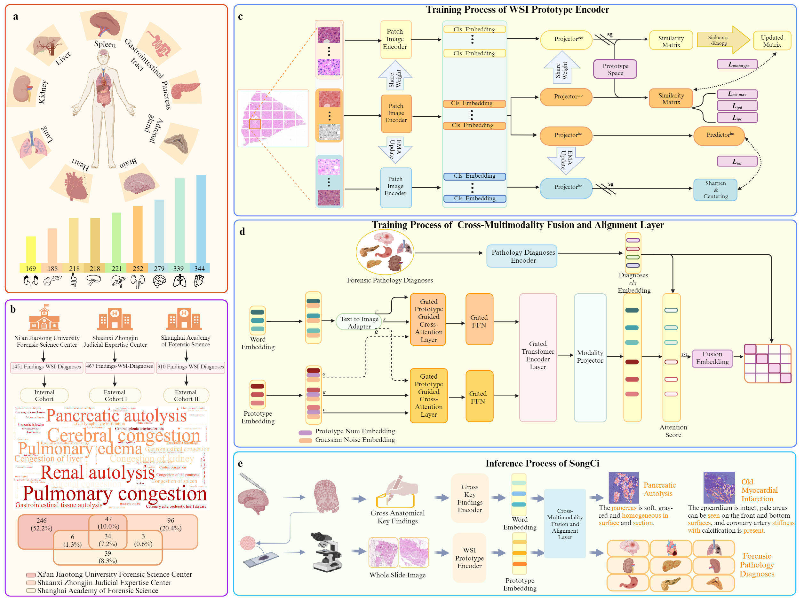

SongCi :dragon_face: 
===========

SongCi is a multi-modal deep learning model tailored for forensic pathological analyses.
The architecture consists of three main parts, i.e., an imaging encoder for WSI feature extraction, a text encoder for the embedding of gross key findings as well as diagnostic queries, and a multi-modal fusion block that integrates the embeddings of WSI and gross key findings to align with those of the diagnostic queries.


[中文](https://github.com/shenxiaochenn/SongCi/blob/master/README_CN.md) ｜ English

## Large-vocabulary forensic pathological analyses via prototypical cross-modal contrastive learning


<div align=center>

  
 ### The framework of SongCi and studied large-vocabulary, multi-center datasets.
</div>


## Updates:
* 05/06/2024: We are working on refining the code updates for the SongCi model.
## Installation:


## WSI preprocessing and the content of text(gross key findings & forensic pathology diagnosis)

### WSI
**NOTE**: In practical scenarios, a single slide can encompass a variety of tissue types. To reduce the labeling time required by forensic scientists, we have adopted a straightforward approach by delineating the area with a simple rectangular boundary. Conversely, regions comprising a single tissue type are segmented without the need for explicit labeling.

```bash
svs_datasets/
  ├── slide_1.svs
  ├── slide_2.svs
  ├── slide_3.svs
  ├── slide_3.json 
  ├── slide_4.svs
  └── ...

```
Here we give an example.
```bash
python patch_tmp.py
```

This will split each WSI at the specifwied magnification by looping through it, while the **JSON** file in this is an annotation file (containing the 4 coordinates of the annotation box).
Finally, we will get the patch-level datasets!

```bash
patch_datasets/
  ├── slide_1/
    ├── slide_1-0_1_.png
    ├── slide_1-0_2_.png
    ├── slide_1-0_3_.png
    └── ...
  ├── slide_2/
    ├── slide_2-0_1_.png
    ├── slide_2-0_2_.png
    ├── slide_2-0_3_.png
    └── ...
  ├── slide_3/
  ├── slide_4/
  └── ...

```
### gross key findings & forensic pathology diagnosis

We provide sample text here in one of our cohorts.

The gross key finding is a paragraph  and forensic pathology diagnosis are text segments delineated by `/`.

```bash
text_xianjiaotong.csv
```
slide_name    | gross key findings | forensic pathology diagnosis
-------- | ----- | -----
slide_1  | The mucosa is smooth, complete and pink, there is no bleeding, ulceration or perforation. | Gastrointestinal congestion/Gastrointestinal tissue autolysis
slide_2  | There is a tear in the bottom of the heart, which leads inward to the left ventricle, the myocardium is dark red, and the coronary artery is stiff.  | Coronary atherosclerotic heart disease/Myocardial infarction with heart rupture/Pericardial tamponade
slide_3  | The envelope of both kidneys is complete and easy to peel, the surface and section are brown red, and the boundary between skin and medulla is clear. | Renal autolysis/Congestion of kidney 

##  train of prototypical WSI encoder

## Connection

:v: If you have a keen interest in forensic pathology and wish to contribute to this field, whether it be through data provision, inquiries about algorithm implementation, innovative suggestions, or a desire for comprehensive communication and collaboration, we encourage you to contact us. We eagerly anticipate engaging in discussions with you!:laughing: :laughing: :laughing:

* **Zhenyuan Wang**  Key Laboratory of National Ministry of Health for Forensic Sciences, School of Medicine \& Forensics, Health Science Center,Xi’an Jiaotong University  Email: wzy218@xjtu.edu.cn
* **Chunfeng Lian** School of Mathematics and Statistics, Xi'an Jiaotong University  Email: chunfeng.lian@xjtu.edu.cn
## Citation

## Related Projects

[dino](https://github.com/facebookresearch/dino)


