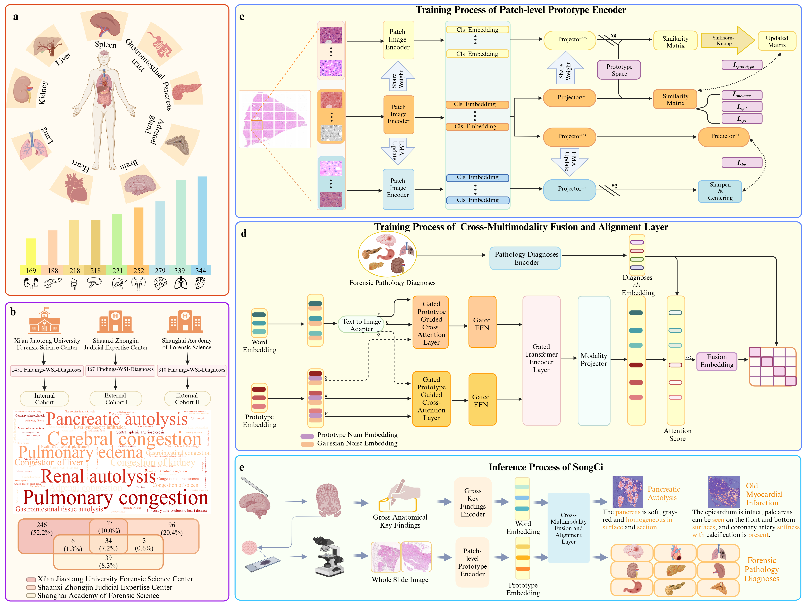
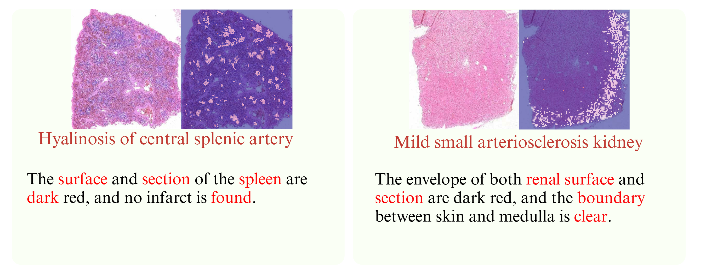

宋慈 :dragon_face: 
===========

宋慈 是一款专为法医病理分析定制的多模态深度学习模型。
其架构由三个主要部分组成，即用于提取 WSI 特征的成像编码器、用于嵌入主要检查结果和诊断查询的文本编码器，以及将 WSI 和主要检查结果的嵌入整合到诊断查询中的多模态融合块。
中文 ｜ [English](https://github.com/shenxiaochenn/SongCi/blob/master/README.md) 

## 通过原型跨模态对比学习进行大词汇框的法医病理分析

<div align=center>

  
 ### The framework of SongCi and studied large-vocabulary, multi-center datasets.
</div>

## 更新:
* 05/06/2024: 我们正在更新代码的内容。
* 28/10/2024： 我们为每个部分都提供了检查点，您现在只需向我们进行简单的申请即可访问这些检查点  [hugging face](https://huggingface.co/shenxiaochen/SongCi) .
* 26/01/2025：快速开始使用这一视觉语言模型进行法医病理诊断。 [Demo of how to use SongCi](https://github.com/shenxiaochenn/SongCi/blob/master/cross-modal-decoder/fusion_demo/multi_modality_diagnosis.ipynb) 以及如何获得 WSI 的嵌入原型。 [Demo of how to get the prototype of each WSI](https://github.com/shenxiaochenn/SongCi/blob/master/prototype_encoder/songci_demo/how%20to%20get%20prototype%20csv.ipynb). (注意：为了安全起见！请通过 [hugging face](https://huggingface.co/shenxiaochen/SongCi) !!!)
* 04/02/2025：我们展示了内部队列中每个样本的法医病理诊断结果以及最终的数值评估结果。[Reproduced results of Internal Cohort](https://github.com/shenxiaochenn/SongCi/blob/master/cross-modal-decoder/fusion_demo/Demo_of_the_internal_cohort(Xian%20Jiaotong).ipynb) 和 [Demo of how to use SongCi](https://github.com/shenxiaochenn/SongCi/blob/master/cross-modal-decoder/fusion_demo/multi_modality_diagnosis.ipynb)
* 18/02/2025：我们展示了一位死者的法医病理尸检 WSI（可公开获取），以便您直观地了解法医病理 WSI 与临床肿瘤 WSI 之间的差异。如果您对法医病理学有浓厚的兴趣，欢迎您立即与我们联系，我们将提供更多真实的法医病例。
## 安装:

**前提须知**:
```bash
python 3.9+
CUDA 12.1
pip
ANACONDA
```


激活虚拟环境后，您可以安装特定的软件包需求，具体如下:
```python
pip install -r requirements.txt
```

**可选的**: Conda 环境设置 对于喜欢使用 Conda 的用户:
```bash
conda create --name songci python=3.9.7
conda activate songci
git clone https://github.com/shenxiaochenn/SongCi.git
cd SongCi
pip install -r requirements.txt
```

## WSI 预处理和文本内容（解剖重要发现和法医病理诊断）

### WSI
**注意**:  在实际应用中，一张载玻片可能包含多种组织类型。为了减少法医所需的标记时间，我们采用了一种简单的方法，即用简单的矩形边界来划分区域。反之，包含单一组织类型的区域则无需明确标记即可分割。

```bash
svs_datasets/
  ├── slide_1.svs
  ├── slide_2.svs
  ├── slide_3.svs
  ├── slide_3.json 
  ├── slide_4.svs
  └── ...

```
这里我们提供一个示例代码
```bash
python patch_tmp.py
```

这将以指定的放大倍数循环分割每个 WSI，而其中的**JSON**文件是一个注释文件（包含注释框的 4 个坐标）。
最后，我们将得到补丁级数据集！

```bash
patch_datasets/
  ├── slide_1/
    ├── slide_1-0_1_.png
    ├── slide_1-0_2_.png
    ├── slide_1-0_3_.png
    └── ...
  ├── slide_2/
    ├── slide_2-0_1_.png
    ├── slide_2-0_2_.png
    ├── slide_2-0_3_.png
    └── ...
  ├── slide_3/
  ├── slide_4/
  └── ...

```
### 大体解剖发现 & 法医病理学诊断

我们在此提供了其中一个队列样本文本。

大体解剖发现是一个段落，法医病理诊断是以 `/` 划分的文本段。

```bash
text_xianjiaotong.csv
```
slide_name    | gross key findings | forensic pathology diagnosis
-------- | ----- | -----
slide_1  | The mucosa is smooth, complete and pink, there is no bleeding, ulceration or perforation. | Gastrointestinal congestion/Gastrointestinal tissue autolysis
slide_2  | There is a tear in the bottom of the heart, which leads inward to the left ventricle, the myocardium is dark red, and the coronary artery is stiff.  | Coronary atherosclerotic heart disease/Myocardial infarction with heart rupture/Pericardial tamponade
slide_3  | The envelope of both kidneys is complete and easy to peel, the surface and section are brown red, and the boundary between skin and medulla is clear. | Renal autolysis/Congestion of kidney 

##  原型对比学习

* 怎样去训练一个原型对比学习网络？
  
**注意**: 在我们的研究中，CUDA 版本为 12.1，python 版本为 3.9。计算实验应在至少配备八块英伟达™（NVIDIA®）GeForce RTX 3090 显卡的系统上进行。如果使用 fp16 进行训练，在我们的研究中，它是不稳定的。
```python
python -m torch.distributed.launch --nproc_per_node=8  prototype_encoder/main_prototype.py   --use_bn_in_head True  --use_pre_in_head True  --use_fp16 False  --batch_size_per_gpu 96 --data_path /path/to/WSI_patch/train --output_dir /path/to/saving_dir
```
结果:
```bash
/path/to/saving_dir/
  ├──  log.txt 
  ├── checkpoint.pth
  ├── queue.pth
  └── ...
```
###  基于原型和实例的 WSI 补丁生成器

如果执行基于原型的生成，请使用 `patch_generation/guided_diffusion/get_ssl_models.py` 文件。

如果执行基于实例的生成，请使用 `patch_generation/guided_diffusion/get_sl_models.py` 文件。

默认：基于原型

**训练**

在 `patch_generation` 文件夹中运行即可：

```bash
sh train.sh 
```
**采样**:

* 基于原型：默认循环遍历所有原型

```bash
sh sample_prototype.sh
```

* 基于实例：选择您喜欢的实例 


```bash
sh sample.sh
```

###   WSI 分割

首先，我们将每个 WSI 转换成一个表格。在表格中，我们可以知道每个补丁属于哪个原型、相似度的确切值以及该补丁在 WSI 中的坐标。

```bash
python wsi_seg/prototype_index.py
```
你将会得到一个WSI的表格.

例子:

patch_name   | WSI_name | x_axis | y_axis |pro_index | sim_value
-------- | ----- | -----| ----- | -----| ----- 
patch_1  | WSI_1 | 0| 0 | 2| 0.9623
patch_2  | WSI_1 | 1| 0 | 56| 0.8958
patch_3  | WSI_1 | 1| 2 | 3| 0.9703

去执行这个文件，你见得到最终的分割结果

```bash
python wsi_seg/wsi_seg_prototype.py
```

## 跨模态对比学习

怎样去训练一个模态融合模块
 
* 训练
```bash
python main_fusion.py  --data_path xxx  --depth 2 --checkpoint xxx(prototype-encoder) --output_dir xxx --gate True --noise_ratio 0.5 --saveckp_freq 100 --warmup_epochs 50
```
在推理阶段, 将返回一个 `csv` 文件，其中包含模型针对所提供样本预测的法医诊断结果。

* 推断分数
```bash
python score_modality.py  --checkpoint xxx(prototype-encoder)  --fusion_checkpoint xxx(fusion block)   --data_path xxx --threshold 0.88  --out_name xx
```

###  多模态可解释性

我们将统计每个原型和每个单词的得分，并将其制作成表格。

 WSI_name | disease | img_dict |text_dict 
 ----- | -----| ----- | -----
 WSI_1 | The hemorrhage under the scalp| {prototype:score} |  {word:score} 
 WSI_2 | Gastrointestinal congestion| {prototype:score} | {word:score} 
 WSI_3 | Gastrointestinal tissue autolysis| {prototype:score} | {word:score} 

* 对于一些例子的代码。
```bash
python visual_modality_index.py
```
示例: 这里我们展示了前 5 个原型和前 5 个单词

<div align=center>

  
 **SongCi 的多模态注意力可视化**
</div>

## 联系方式

:v: 如果您对法医病理学有着浓厚的兴趣，并希望为这一领域做出贡献，无论是通过提供数据、询问算法实施情况、提出创新建议，还是希望进行全面的交流与合作，我们都鼓励您与我们联系。我们热切期待与您进行讨论！:laughing: :laughing: :laughing:

* **王振原** 西安交通大学 法医学院  Email: wzy218@xjtu.edu.cn
* **练春峰** 西安交通大学 数学与统计学院  Email: chunfeng.lian@xjtu.edu.cn
*  **申忱** 西安交通大学   Email: shenxiaochen@stu.xjtu.edu.cn
## 引用
如果您发现 SongCi 对您的研究和应用有用，请使用此 BibTeX 引用：

```bibtex
@misc{shen2024largevocabularyforensicpathologicalanalyses,
      title={Large-vocabulary forensic pathological analyses via prototypical cross-modal contrastive learning}, 
      author={Chen Shen and Chunfeng Lian and Wanqing Zhang and Fan Wang and Jianhua Zhang and Shuanliang Fan and Xin Wei and Gongji Wang and Kehan Li and Hongshu Mu and Hao Wu and Xinggong Liang and Jianhua Ma and Zhenyuan Wang},
      year={2024},
      eprint={2407.14904},
      archivePrefix={arXiv},
      primaryClass={eess.IV},
      url={https://arxiv.org/abs/2407.14904}, 
}
```
## 相关项目

[dino](https://github.com/facebookresearch/dino)

[guided-diffusion](https://github.com/openai/guided-diffusion)

[flamingo](https://github.com/lucidrains/flamingo-pytorch)

