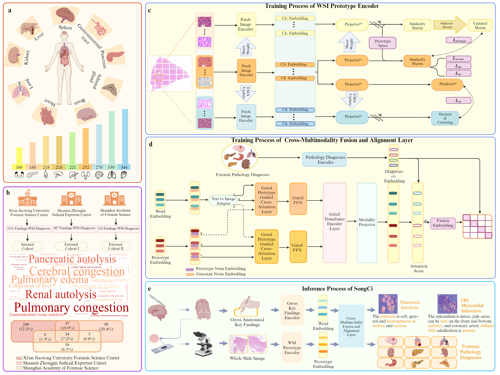

宋慈 :dragon_face: 
===========

宋慈 是一款专为法医病理分析定制的多模态深度学习模型。
其架构由三个主要部分组成，即用于提取 WSI 特征的成像编码器、用于嵌入主要检查结果和诊断查询的文本编码器，以及将 WSI 和主要检查结果的嵌入整合到诊断查询中的多模态融合块。
中文 ｜ [English](https://github.com/shenxiaochenn/SongCi/blob/master/README.md) 

## 通过原型跨模态对比学习进行大词汇框的法医病理分析

<div align=center>

  
 ### The framework of SongCi and studied large-vocabulary, multi-center datasets.
</div>

## Updates:
* 05/06/2024: We are working on refining the code updates for the SongCi model.
## Installation:

**Pre-requisites**:
```bash
python 3.9+
CUDA 12.1
pip
ANACONDA
```


After activating the virtual environment, you can install specific package requirements as follows:
```python
pip install -r requirements.txt
```

**Optional**: Conda Environment Setup For those who prefer using Conda:
```bash
conda create --name songci python=3.9.7
conda activate songci
git clone https://github.com/shenxiaochenn/SongCi.git
cd SongCi
pip install -r requirements.txt
```

## WSI preprocessing and the content of text(gross key findings & forensic pathology diagnosis)

### WSI
**NOTE**: In practical scenarios, a single slide can encompass a variety of tissue types. To reduce the labeling time required by forensic scientists, we have adopted a straightforward approach by delineating the area with a simple rectangular boundary. Conversely, regions comprising a single tissue type are segmented without the need for explicit labeling.


```bash
svs_datasets/
  ├── slide_1.svs
  ├── slide_2.svs
  ├── slide_3.svs
  ├── slide_3.json 
  ├── slide_4.svs
  └── ...

```
Here we give an example.
```bash
python patch_tmp.py
```

This will split each WSI at the specifwied magnification by looping through it, while the **JSON** file in this is an annotation file (containing the 4 coordinates of the annotation box).
Finally, we will get the patch-level datasets!

```bash
patch_datasets/
  ├── slide_1/
    ├── slide_1-0_1_.png
    ├── slide_1-0_2_.png
    ├── slide_1-0_3_.png
    └── ...
  ├── slide_2/
    ├── slide_2-0_1_.png
    ├── slide_2-0_2_.png
    ├── slide_2-0_3_.png
    └── ...
  ├── slide_3/
  ├── slide_4/
  └── ...

```
### gross key findings & forensic pathology diagnosis

We provide sample text here in one of our cohorts.

The gross key finding is a paragraph  and forensic pathology diagnosis are text segments delineated by `/`.

```bash
text_xianjiaotong.csv
```
slide_name    | gross key findings | forensic pathology diagnosis
-------- | ----- | -----
slide_1  | The mucosa is smooth, complete and pink, there is no bleeding, ulceration or perforation. | Gastrointestinal congestion/Gastrointestinal tissue autolysis
slide_2  | There is a tear in the bottom of the heart, which leads inward to the left ventricle, the myocardium is dark red, and the coronary artery is stiff.  | Coronary atherosclerotic heart disease/Myocardial infarction with heart rupture/Pericardial tamponade
slide_3  | The envelope of both kidneys is complete and easy to peel, the surface and section are brown red, and the boundary between skin and medulla is clear. | Renal autolysis/Congestion of kidney 

##  prototypical contrastive learning

* how to train the prototypical self-supervised contrastive learning?
  
**NOTE**: In our study, the CUDA version is 12.1 and python is 3.9. The computational experiments should be conducted on a system equipped with a minimum of eight NVIDIA GeForce RTX 3090 graphics cards. If you use fp16 for training,  in our study, it's unstable.
```python
python -m torch.distributed.launch --nproc_per_node=8  prototype_encoder/main_prototype.py   --use_bn_in_head True  --use_pre_in_head True  --use_fp16 False  --batch_size_per_gpu 96 --data_path /path/to/WSI_patch/train --output_dir /path/to/saving_dir
```
results:
```bash
/path/to/saving_dir/
  ├──  log.txt 
  ├── checkpoint.pth
  ├── queue.pth
  └── ...
```
###   WSI patch generator both prototype-based & instance-based

If you implement prototype-based generation, use the `patch_generation/guided_diffusion/get_ssl_models.py` file.

If you implement instance-based generation, use the `patch_generation/guided_diffusion/get_sl_models.py` file.

default: prototype-based

**train**

IN the `patch_generation` folder, just run:

```bash
sh train.sh 
```
**sampling**:

* prototype-based : the default loop iterates over all prototypes

```bash
sh sample_prototype.sh
```

* instance-based: choose the instance what you like 


```bash
sh sample.sh
```

###   WSI 分割

首先，我们将每个 WSI 转换成一个表格。在表格中，我们可以知道每个补丁属于哪个原型、相似度的确切值以及该补丁在 WSI 中的坐标。

```bash
python wsi_seg/prototype_index.py
```
你将会得到一个WSI的表格.

例子:

patch_name   | WSI_name | x_axis | y_axis |pro_index | sim_value
-------- | ----- | -----| ----- | -----| ----- 
patch_1  | WSI_1 | 0| 0 | 2| 0.9623
patch_2  | WSI_1 | 1| 0 | 56| 0.8958
patch_3  | WSI_1 | 1| 2 | 3| 0.9703

去执行这个文件，你见得到最终的分割结果

```bash
python wsi_seg/wsi_seg_prototype.py
```

## 跨模态对比学习

怎样去训练一个模态融合模块
 
* 训练
```bash
python main_fusion.py  --data_path xxx  --depth 2 --checkpoint xxx(prototype-encoder) --output_dir xxx --gate True --noise_ratio 0.5 --saveckp_freq 100 --warmup_epochs 50
```
在推理阶段, 将返回一个 `csv` 文件，其中包含模型针对所提供样本预测的法医诊断结果。

* 推断分数
```bash
python score_modality.py  --checkpoint xxx(prototype-encoder)  --fusion_checkpoint xxx(fusion block)   --data_path xxx --threshold 0.88  --out_name xx
```

###  多模态可解释性

我们将统计每个原型和每个单词的得分，并将其制作成表格。

 WSI_name | disease | img_dict |text_dict 
 ----- | -----| ----- | -----
 WSI_1 | The hemorrhage under the scalp| {prototype:score} |  {word:score} 
 WSI_2 | Gastrointestinal congestion| {prototype:score} | {word:score} 
 WSI_3 | Gastrointestinal tissue autolysis| {prototype:score} | {word:score} 

* 对于一些例子的代码。
```bash
python visual_modality_index.py
```
示例: 这里我们展示了前 5 个原型和前 5 个单词

<div align=center>

  
 **SongCi 的多模态注意力可视化**
</div>

## 联系方式

:v: 如果您对法医病理学有着浓厚的兴趣，并希望为这一领域做出贡献，无论是通过提供数据、询问算法实施情况、提出创新建议，还是希望进行全面的交流与合作，我们都鼓励您与我们联系。我们热切期待与您进行讨论！:laughing: :laughing: :laughing:

* **王振原** 西安交通大学 法医学院  Email: wzy218@xjtu.edu.cn
* **练春峰** 西安交通大学 数学与统计学院  Email: chunfeng.lian@xjtu.edu.cn
*  **申忱** 西安交通大学   Email: shenxiaochen@stu.xjtu.edu.cn
## 引用

## 相关项目

[dino](https://github.com/facebookresearch/dino)

[guided-diffusion](https://github.com/openai/guided-diffusion)

[flamingo](https://github.com/lucidrains/flamingo-pytorch)

